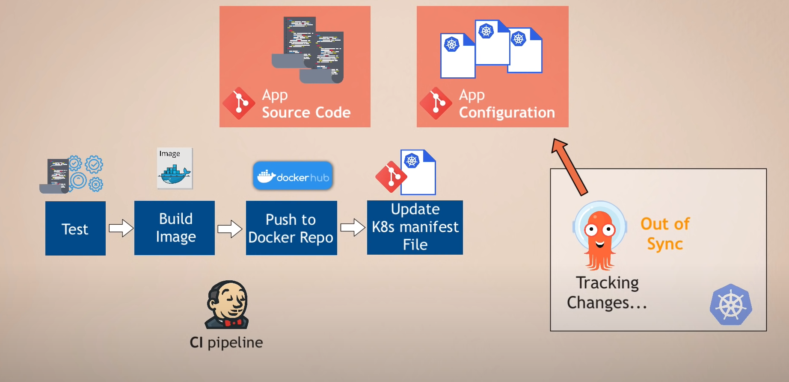
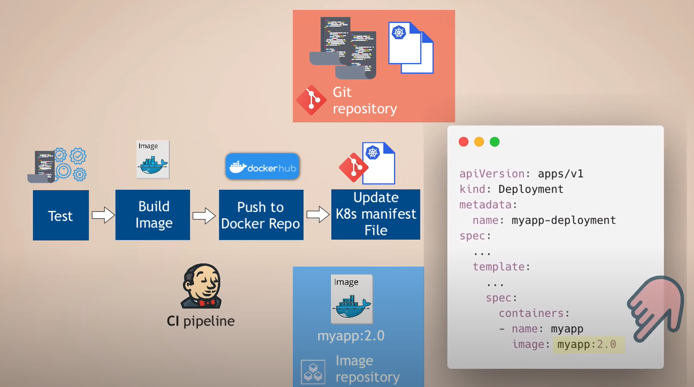

# Ecommerce App - CD and GitOps with Argo CD 

## Stage 1: Continuos Integration process
Updates in app code triggers on CI pipeline process to build/test/deploy the container image for application component.
The CI pipeline will update the app CD configuration files with the new image of the component of the application. Argo CD allows us to use Argo Rollouts.

## Stage 2: Continuos Delivery process:
ArgoCD allows the code repository (thats why the term GitOps) to be the source of truth. So the app is redeployed on the K8s cluster with the new image.
In such a way, even if the developer/ops team update the state of the application with kubectl command, ArgoCD will detect the change and redeploy the app to the desired state.
